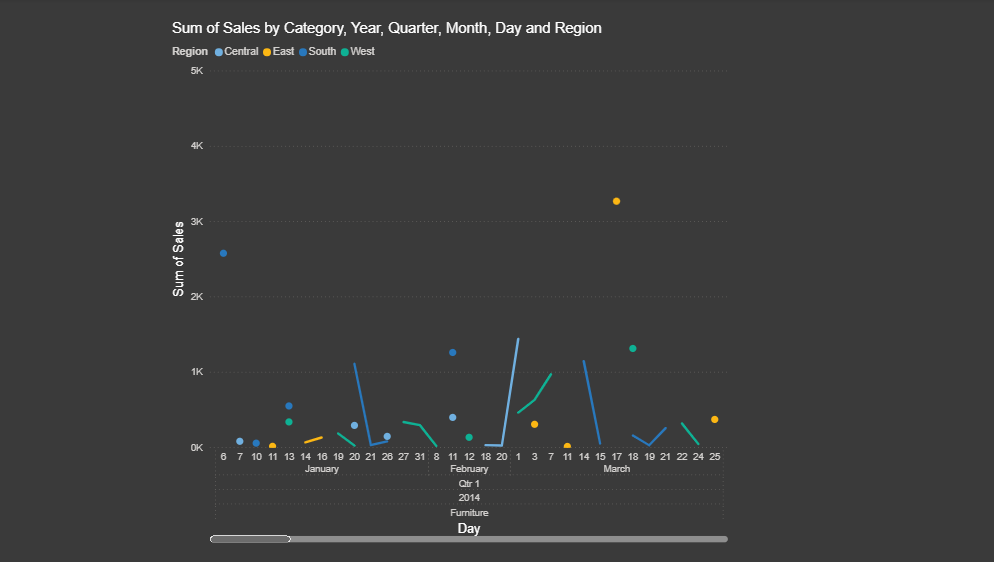

# 📊 Interactive Dashboard – CODTECH Task-3

## Objective

Create an interactive dashboard using Power BI.

## Tools Used

* Power BI
* CSV Dataset

## Features

* Total Sales KPI
* Sales by Category
* Sales by Region
* Sales Trend
* Filters (Slicer)

## Dashboard Preview

